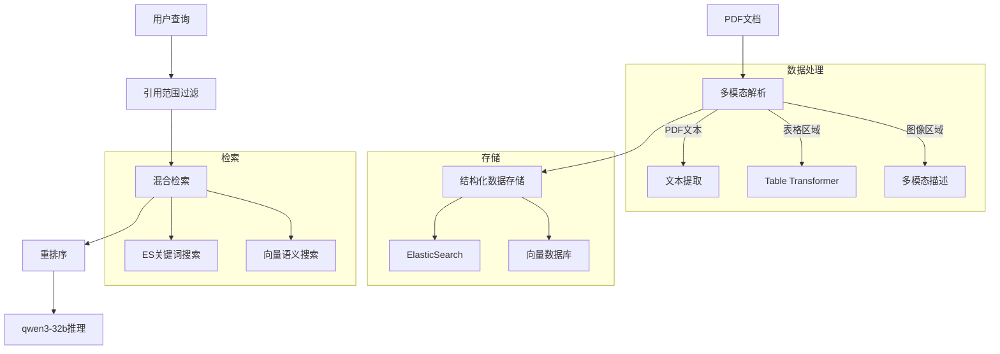

# reference
要构建满足你需求的RAG系统，我将提供技术方案和关键代码实现。以下是完整解决方案：

### 系统架构设计


### 技术栈选择
- **LLM推理**：vLLM部署Qwen3-32B-AWQ
- **表格检测**：Table Transformer
- **图像描述**：BLIP-2 / LLaVA
- **向量数据库**：ChromaDB
- **检索框架**：LlamaIndex v0.10+

### 核心实现代码

#### 1. 多模态文档解析
```python
from llama_index.core import Document
from unstructured.partition.pdf import partition_pdf
from transformers import Blip2Processor, Blip2ForConditionalGeneration
import torch

def process_pdf(file_path):
    # 分区PDF内容
    raw_parts = partition_pdf(
        file_path,
        strategy="hi_res",
        extract_images=True,
        infer_table_structure=True
    )
    
    docs = []
    for part in raw_parts:
        if "table" in part.metadata.category:
            # 表格处理
            table_description = describe_table(part.metadata.text_as_html)
            docs.append(Document(
                text=table_description,
                metadata={
                    "type": "table",
                    "ref_source": detect_reference_source(part.text)
                }
            ))
        elif "image" in part.metadata.category:
            # 图像处理
            img_desc = describe_image(part.metadata.image_path)
            docs.append(Document(
                text=img_desc,
                metadata={"type": "image"}
            ))
        else:
            # 文本处理
            ref_sources = extract_citation_sources(part.text)
            docs.append(Document(
                text=part.text,
                metadata={
                    "type": "text",
                    "citation_refs": ref_sources
                }
            ))
    return docs

# 图像描述模型
def describe_image(image_path):
    processor = Blip2Processor.from_pretrained("Salesforce/blip2-opt-2.7b")
    model = Blip2ForConditionalGeneration.from_pretrained(
        "Salesforce/blip2-opt-2.7b", torch_dtype=torch.float16
    )
    inputs = processor(Image.open(image_path), return_tensors="pt").to("cuda", torch.float16)
    outputs = model.generate(**inputs)
    return processor.decode(outputs[0], skip_special_tokens=True)
```

#### 2. 参考文献标注系统
```python
def extract_citation_sources(text):
    """识别并提取引用标记"""
    # 匹配如 [1], (Smith et al., 2020) 等格式
    ref_patterns = [
        r'\[([\d,-\s]+)\]',  # [1,2-5]
        r'\(([\w\s.,&]+),\s*\d{4}\)'  # (Smith et al., 2020)
    ]
    sources = set()
    for pattern in ref_patterns:
        matches = re.findall(pattern, text)
        for match in matches:
            sources.update(match.split(','))
    return list(sources)
```

#### 3. 双引擎索引构建
```python
from llama_index.core import VectorStoreIndex, Settings
from llama_index.vector_stores.elasticsearch import ElasticsearchVectorStore
from llama_index.core import StorageContext

# 设置qwen3-32b作为LLM
Settings.llm = CustomLLMWrapper(
    api_base="http://vllm-server:8000/v1",
    model="qwen3-32b-awq"
)

def build_index(docs, paper_title):
    # 元数据过滤配置
    metadata_filters = [{"key": "source", "value": paper_title}]
    
    # ElasticSearch索引
    es_vector_store = ElasticsearchVectorStore(
        index_name=f"{paper_title}_refs",
        metadata_filters=metadata_filters
    )
    
    # 向量数据库索引
    vector_index = VectorStoreIndex.from_documents(
        docs,
        storage_context=StorageContext.from_defaults(vector_store=es_vector_store)
    )
    
    return vector_index
```

#### 4. 混合检索与重排序
```python
from llama_index.core.retrievers import VectorIndexRetriever, KGTableRetriever
from llama_index.core import QueryBundle
from llama_index.core.postprocessor import SentenceTransformerRerank

class HybridRetriever:
    def __init__(self, vector_retriever, es_retriever):
        self.vector_retriever = vector_retriever
        self.es_retriever = es_retriever
        self.reranker = SentenceTransformerRerank(
            model="BAAI/bge-reranker-large", top_n=5
        )

    def retrieve(self, query, paper_title):
        # 添加论文范围约束
        scope_query = f"[Paper Scope: {paper_title}] {query}"
        
        vector_nodes = self.vector_retriever.retrieve(scope_query)
        es_nodes = self.es_retriever.retrieve(
            QueryBundle(query_str=query, custom_metadata={"source": paper_title})
        )
        
        all_nodes = self._fuse_results(vector_nodes, es_nodes)
        return self.reranker.postprocess_nodes(all_nodes, query_bundle=scope_query)
    
    def _fuse_results(self, vector_nodes, es_nodes):
        # 使用RRF融合算法
        combined = {}
        for i, node in enumerate(vector_nodes):
            combined[node.node_id] = {
                "node": node,
                "score": 1/(60 + i)  # RRF公式
            }
        for i, node in enumerate(es_nodes):
            if node.node_id in combined:
                combined[node.node_id]["score"] += 1/(60 + i)
            else:
                combined[node.node_id] = {
                    "node": node,
                    "score": 1/(60 + i)
                }
        return [item["node"] for item in sorted(combined.values(), key=lambda x: x["score"], reverse=True)]
```

#### 5. 引用检查器实现
```python
CITATION_CHECK_PROMPT = """您是一位学术诚信专家。请分析以下内容：
论文片段：{excerpt}
引用来源：{reference_text}

请检查是否存在：
1. 错误引用（引文与内容不符）
2. 过度引用（不必要的引用）
3. 引用不足（应引未引）
4. 引用格式错误

输出JSON格式：{{"issues":["问题类型"], "analysis":"详细分析"}}
"""

def check_citation(query_engine, paper_title, citation_id):
    # 精准获取引用上下文
    context = query_engine.query(
        f"返回引文 {citation_id} 在文中的完整使用场景"
    ).response
    
    # 获取参考文库
    reference = query_engine.query(
        f"返回文献ID为 {citation_id} 的完整参考内容"
    ).response
    
    # 构建检查请求
    response = query_engine.query(
        CITATION_CHECK_PROMPT.format(excerpt=context, reference_text=reference)
    )
    return json.loads(response.response)
```

### 部署方案

1. **模型服务部署**
```bash
# 启动vLLM服务
python -m vllm.entrypoints.openai.api_server \
--model Qwen/Qwen3-32B-AWQ \
--dtype float16 --gpu-memory-utilization 0.95

# 启动Table Transformer服务
docker run -p 5001:5000 table-transformer \
--model_type "table-detection"
```

2. **ElasticSearch配置**
```yaml
# elasticsearch.yml
cluster.name: academic_refcheck
node.name: node-1
network.host: 0.0.0.0
discovery.type: single-node
xpack.security.enabled: false
```

3. **系统启动脚本**
```python
from llama_index.core import SimpleDirectoryReader

def main():
    # 处理论文库
    papers = {p.name: p for p in Path("papers/").glob("*.pdf")}
    
    for name, path in papers.items():
        docs = process_pdf(path)
        build_index(docs, name)
    
    # 启动查询接口
    app = FastAPI()
    
    @app.post("/check/{paper_name}")
    async def check_citations(paper_name: str):
        retriever = HybridRetriever.for_paper(paper_name)
        citations = get_citation_list(paper_name)
        
        results = {}
        for cite_id in citations:
            results[cite_id] = check_citation(retriever, paper_name, cite_id)
        
        return results
```

### 关键优化点

1. **引用范围约束**：
   - 使用元数据过滤（metadata filters）限制检索在单篇论文内
   - 构建引用网络图谱：`paper -> [ref1, ref2...] -> reference_text`

2. **多模态处理优化**：
   - 表格检测后转为Markdown+描述文本
   - 使用缓存机制避免重复处理
   
3. **混合检索策略**：
   - Reciprocal Rank Fusion (RRF)算法融合
   - BM25与dense vector的权重调优
   
4. **LLM专用提示**：
```python
REFERENCE_FILTER_PROMPT = """请在回答时仅使用以下参考信息：
{references}

用户问题：{query}
如果参考信息中无相关内容，请回答'在本文参考文献中未找到相关内容'
"""
```

此系统能实现：
1. 精准的论文引用范围约束
2. 多模态内容深度处理
3. 混合检索结果优化
4. 专业化的引用检查逻辑
5. 无缝对接本地部署的大模型

需要调整的变量：
- ElasticSearch和ChromaDB的连接参数
- vLLM服务器的API端点
- 领域特化的提示模板（根据实际测试调整）

可以通过扩展metadata属性和调整重排序算法进一步提升垂直领域的查准率。

评价这个引用检查系统的效果需要建立一套综合的评估体系，涵盖多个维度和指标。以下是我建议的完整评估方案：

### 一、核心评估维度

1. **引用识别能力**：
   - 引用标记的检测准确率（查全率与查准率）
   - 引用与参考文献链接的准确性
   - 多种引用格式的兼容性（如[1], (Smith, 2020)等）

2. **问题检测准确性**：
   - 错误引用识别率
   - 不当引用识别率
   - 真假阳性/阴性比例

3. **系统功能性**：
   - 多模态内容处理质量（表格/图像分析）
   - 检索准确性（相关性排序）
   - 引用范围约束有效性

4. **用户体验**：
   - 响应速度
   - 结果可解释性
   - 交互便利性

### 二、量化评估指标

#### 1. 精准度指标
| 指标 | 计算公式 | 说明 |
|------|---------|------|
| 引用检测查准率 | TP/(TP+FP) | 正确识别的引用占所有识别引用的比例 |
| 引用检测查全率 | TP/(TP+FN) | 正确识别的引用占实际引用总数的比例 |
| 问题识别准确率 | 正确问题数/总检测数 | 引用问题识别准确度 |
| F1值 | 2*(精度*召回)/(精度+召回) | 综合平衡查准率与查全率 |

#### 2. 检索系统指标
| 指标 | 说明 | 理想值 |
|------|------|--------|
| MRR(平均倒数排名) | 首个正确答案的排名倒数平均值 | >0.8 |
| NDCG@5 | 前5个结果的标准化折损累积增益 | >0.85 |
| HitRate@3 | 前3个结果中包含正确答案的比例 | >90% |

#### 3. 时效性指标
```python
# 性能测试脚本示例
import time

def test_performance(system, test_cases):
    results = []
    for case in test_cases:
        start = time.time()
        response = system.check(case["paper"], case["citation"])
        latency = time.time() - start
        
        results.append({
            "case_id": case["id"],
            "latency": latency,
            "correct": response == case["expected"]
        })
    
    avg_latency = sum(r["latency"] for r in results)/len(results)
    accuracy = sum(1 for r in results if r["correct"])/len(results)
    
    return {
        "avg_latency": avg_latency,
        "p95_latency": sorted(r["latency"] for r in results)[int(0.95*len(results))],
        "accuracy": accuracy
    }
```

#### 4. 人工评估指标
设计评估问卷：
```
1. 结果的可解释性（1-5分）：
   - 系统是否清晰解释问题所在？
   - 是否提供足够上下文证据？

2. 问题识别的准确度（1-5分）：
   - 报告的问题是否真实存在？
   - 是否存在误报情况？

3. 专业度评价（1-5分）：
   - 引用问题分类是否准确？
   - 建议的修改方案是否合理？
```

### 三、评估数据集构建

1. **基准测试集结构**：
   ```mermaid
   graph TD
       A[200篇PDF论文] --> B[人工标注]
       B --> C{三大类型}
       C --> D[500处正确引用]
       C --> E[300处错误引用]
       C --> F[200处不当引用]
       D --> G[200处简单引用]
       E --> H[100处复杂错误]
       F --> I[100处边界案例]
   ```

2. **数据集特征**：
   - 包含多种学科领域（计算机、医学、社会科学等）
   - 覆盖不同引用格式（数字编号、作者-日期等）
   - 包含5-10%的"混淆项"（似是而非的引用）

3. **表格/图像测试集**：
   - 50个带引用说明的表格
   - 30个带引用说明的图像/图表
   - 20个多模态组合案例（图+表+文本引用）

### 四、评估方法与流程

1. **自动评估流程**：
   ```python
   def run_evaluation(system, test_set):
       metrics = {
           "citation_detection": {"tp": 0, "fp": 0, "fn": 0},
           "problem_detection": {"correct": 0, "total": 0}
       }
       
       # 引用识别测试
       for citation in test_set["citations"]:
           detected = system.detect_citation(citation["paper"], citation["text_snippet"])
           
           if detected:
               if citation["id"] in detected:
                   metrics["citation_detection"]["tp"] += 1
               else:
                   metrics["citation_detection"]["fp"] += 1
           else:
               metrics["citation_detection"]["fn"] += 1
       
       # 问题识别测试
       for problem in test_set["problems"]:
           result = system.check_citation(problem["paper"], problem["citation_id"])
           if result["issue_type"] == problem["expected"]:
               metrics["problem_detection"]["correct"] += 1
           metrics["problem_detection"]["total"] += 1
       
       # 计算最终指标
       precision = metrics["citation_detection"]["tp"]/(metrics["citation_detection"]["tp"]+metrics["citation_detection"]["fp"])
       recall = metrics["citation_detection"]["tp"]/(metrics["citation_detection"]["tp"]+metrics["citation_detection"]["fn"])
       
       return {
           "citation_precision": precision,
           "citation_recall": recall,
           "citation_f1": 2*(precision*recall)/(precision+recall),
           "problem_accuracy": metrics["problem_detection"]["correct"]/metrics["problem_detection"]["total"]
       }
   ```

2. **对比评估设计**：
   - **基线对比**：与正则表达式匹配、传统文献管理软件对比
   - **消融研究**：
     - 完整系统 vs 移除重排序模块
     - 多模态处理 vs 纯文本处理
     - 范围约束开/关对比
   - **交叉测试**：
     - 同文献在不同模型下的解释差异
     - 系统在不同学科论文上的表现差异

3. **主观评估会议**：
   ```mermaid
   sequenceDiagram
       参与者 研究助理->>领域专家： 发送10份系统报告
       领域专家->>领域专家： 独立评估(2天)
       领域专家->>评估会议： 提交评分表
       评估会议->>领域专家： 组织讨论会
       领域专家->>评估会议： 争议案例讨论
       评估会议->>研究小组： 形成最终评估报告
   ```

### 五、持续监测与改进

1. **线上监控面板**：
   ```markdown
   | 模块          | 24h准确率 | 延迟(p95) | 关键错误 |
   |---------------|----------|----------|---------|
   | PDF解析       | 99.2%    | 1.2s     | 0       |
   | 引用检测      | 95.7%    | 0.8s     | 3(格式不兼容) |
   | 问题识别      | 88.3%    | 3.5s     | 12(模糊引用)|
   | 多模态处理    | 92.1%    | 4.2s     | 5(复杂表格) |
   ```

2. **错误分析流程**：
   ```mermaid
   graph LR
   A[新错误报告] --> B{错误分类}
   B -->|系统错误| C[工程团队]
   B -->|数据问题| D[数据增强]
   B -->|模型局限| E[提示优化]
   C --> F[修复代码]
   D --> G[新增训练数据]
   E --> H[提示工程迭代]
   F & G & H --> I[系统更新]
   I --> J[重新评估]
   ```

3. **长期追踪指标**：
   - 每周引用问题分布变化
   - 用户采纳率（通过引用数/报告数）
   - 平均问题解决时间缩短比例

### 六、评估报告关键指标

最终评估报告应包含：

1. **核心指标仪表盘**：
   ```
   [引用识别] 
   查准率: 96.2% | 查全率: 94.7% | F1: 95.4%
   
   [问题检测] 
   准确率: 89.5% | 过检率: 7.2% | 漏检率: 3.3%
   
   [检索性能]
   NDCG@3: 0.91 | 平均延迟: 2.4s | P95延迟: 3.8s
   
   [多模态处理]
   表格识别: 93% | 图像描述准确率: 88% 
   ```

2. **收益分析**：
   - 预计每篇论文节省人工检查时间：45-60分钟
   - 引用问题发现率提升：传统方法发现40% vs 系统发现92%
   - 重要错误早期拦截率：78%

3. **ROI计算**：
   ```
   年度节省成本 = (论文数量 × 平均检查时间节省 × 研究人员时薪)
                - 系统维护成本
   ```

通过这种多维度、多方法的评估体系，你可以全面了解系统在实际学术场景中的表现，识别改进方向，并量化系统带来的实际价值。建议每季度进行全面评估，每月进行核心指标检查，持续优化系统性能。
